---
 智能搜索引擎课程设计 SearchEngine_SimpleDEMO   			
---


## 项目整体架构设计

### 1. 项目目录结构

```markdown
Book_SearchEngine/
├── book_with_author/      # 保存爬取的小说内容
├── craw_main.py           # 爬虫入口程序
├── functions.py           # 爬虫核心功能模块
├── import_files.py        # 数据导入模块
├── indexer.py             # 索引构建模块
├── models.py              # 数据库模型
├── search.py              # 搜索和推荐模块 (已删除，被迭代为app.py前端网页。对应“四、搜索与推荐模块”，仅作为记录。)
├── app.py                 # Flask 应用
├── templates/             # 模板目录
│   └── index.html         # 前端模板
├── settings.py            # 配置文件
└── README.md              # 项目说明
```

**执行顺序以及调用关系：**

```
craw_main.py -----调用-----> functions.py
   | 
   | 请等待爬虫程序完成
   | 
   v
import_files.py -----调用-----> models.py
   |                               
   | 请等待导入数据库程序完成		 
   |                               
   v                               	
indexer.py ----------调用---------- models.py --------生成-------> custom_dict.txt(自定义词典) & indexdir(索引文件)
   | 
   | 请等待构建倒排序索引程序完成
   | 
   v
 app.py	-----调用-----> indexer.py & templates/index.html --------生成-------> 页面 http://127.0.0.1:5000
 
```


#### 2. 模块功能概述

##### 2.1 配置文件 (`settings.py`)

配置文件包含爬虫运行所需的全局设置，包括用户代理、主机地址、数据库连接信息等。

##### 2.2 爬虫核心功能模块 (`functions.py`)

该模块实现了爬虫的核心功能，包括：

- **检查URL是否访问过**：避免重复爬取。
- **获取网页内容**：发送HTTP请求并获取网页内容，支持重试机制。
- **爬取具体内容页面**：从小说页面中提取章节信息并保存到本地文本文件。
- **爬取列表页面**：从类别页面中提取小说链接及信息，并进一步爬取具体内容。
- **爬取主页**：从主页开始，依次爬取各个类别的小说列表页面。

##### 2.3 数据导入模块 (`import_files.py`)

该模块负责将爬取的小说数据导入到数据库中，主要步骤包括：

- **检测文件编码**：确保文件可以正确读取。
- **读取文件内容**：解析小说章节信息。
- **保存到数据库**：将解析到的数据保存到数据库中。

##### 2.4 索引构建模块 (`indexer.py`)

该模块负责将存储在数据库中的小说数据建立倒排索引库，以支持高效的全文检索。主要步骤包括：

- **定义索引Schema**：指定需要索引的字段。
- **创建索引目录**：初始化索引存储位置。
- **构建索引**：从数据库中读取数据，并建立索引。

##### 2.5 数据库模型 (`models.py`)

该模块定义了数据库模型，描述了数据表结构。主要包括：

- **小说类型**
- **小说名称**
- **小说作者**
- **章节号**
- **章节名**
- **章节URL**

##### 2.6 爬虫程序入口 (`craw_main.py`)

爬虫程序的入口文件，负责启动爬虫项目。通过调用 `functions.py` 中的核心函数开始爬取任务。

#### 3. 工作流程

1. **启动爬虫**： 运行 `craw_main.py`，从配置的 `START_URL` 开始爬取主页内容。
2. **爬取主页**： 从主页提取各个小说类别的链接，并为每个类别创建独立的目录。
3. **爬取类别页面**： 从每个类别页面提取小说的链接、名称和作者信息，并保存到相应目录。
4. **爬取小说内容**： 进入每个小说链接页面，提取章节信息并保存到本地文本文件中。
5. **数据导入**： 运行 `import_files.py`，将本地文本文件中的小说数据解析并导入到数据库中。
6. **建立索引**： 运行 `indexer.py`，从数据库中读取数据，并建立倒排索引库，支持全文检索。

### 架构图

```
              +----------------------+
              |    配置文件 settings.py   |
              +-----------+----------+
                          |
                          v
              +-----------+----------+
              |  程序入口 craw_main.py  |
              +-----------+----------+
                          |
                          v
              +-----------+----------+
              |   爬虫功能 functions.py  |
              +-----------+----------+
                          |
            +-------------+-------------+
            |                           |
            v                           v
+-----------+----------+      +---------+----------+
| 爬取主页 crawl_index_page |  | 爬取列表页 crawl_list_page |
+-----------+----------+      +---------+----------+
                          |
                          v
              +-----------+----------+
              | 爬取内容页 crawl_source_page |
              +-----------+----------+
                          |
                          v
              +-----------+----------+
              |  数据导入 import_files.py  |
              +-----------+----------+
                          |
                          v
              +-----------+----------+
              | 数据库模型 models.py     |
              +-----------+----------+
                          |
                          v
              +-----------+----------+
              |  索引构建 indexer.py     |
              +----------------------+
```


## 一、爬虫

### 1.网页内容爬取设计

在本次实验中，我们设计并实现了一个多线程的网页爬虫，旨在从小说网站中提取小说目录及章节信息，并将这些数据存储到本地的文本文件中。爬虫的设计分为以下几个部分：

##### 1.1 爬虫整体架构

爬虫的整体架构如下：

1. **入口函数**：`crawl_index_page` 函数从主页开始，爬取各个类别的小说列表页面。
2. **列表页面爬取**：`crawl_list_page` 函数爬取每个类别页面中的具体小说链接和相关信息。
3. **内容页面爬取**：`crawl_source_page` 函数爬取具体小说的章节信息并将其保存到文本文件中。
4. **多线程支持**：使用 `threading` 模块来提高爬取速度，防止阻塞。


##### 1.2 代码详解

1. **获取网页内容 (`get_page` 函数)**： 该函数发送 HTTP 请求获取网页内容，如果请求失败则进行最多三次重试。在每次重试之间添加一个随机延时，以防止频繁请求被目标服务器拒绝。
2. **爬取具体内容页面 (`crawl_source_page` 函数)**： 该函数从具体的小说页面中提取章节信息，并将章节名称和 URL 写入到本地文本文件中。
3. **爬取列表页面 (`crawl_list_page` 函数)**： 该函数处理每个类别页面，提取小说链接、名称和作者信息，并调用 `crawl_source_page` 函数爬取具体小说的章节内容。
4. **爬取主页 (`crawl_index_page` 函数)**： 该函数从主页开始，爬取各个类别页面的链接，并为每个类别创建一个独立的目录。然后，为每个类别页面创建一个线程进行爬取。
5. **自定义线程类 (`MyThread` 类)**： 该类继承自 `threading.Thread`，用于并发处理不同类别页面的爬取任务。

##### 1.3本地数据存储展示

小说类别作为文件名：


小说名与小说作者拼接作为.txt文件名称（格式为：小说名_作者）：

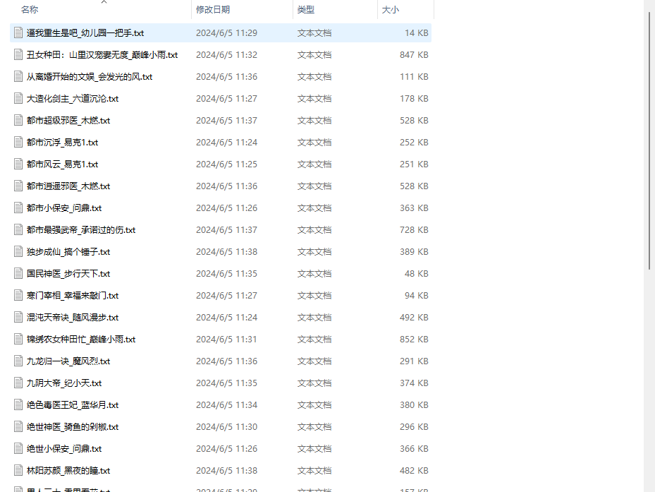

.txt文件内部存储整本小说的所有章节、章节名、章节url：

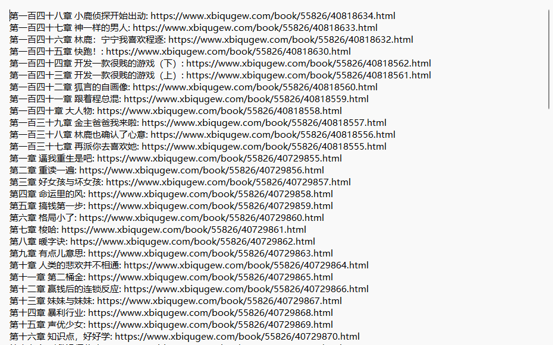


### 2.反制反爬虫机制：

#### 2.1随机'User-Agent'

引入大量的'User-Agent'，并在请求时使用“random()”随机调用，以达到模拟不同主机访问，防止被反爬虫而中断。

> ./settings.py  UA

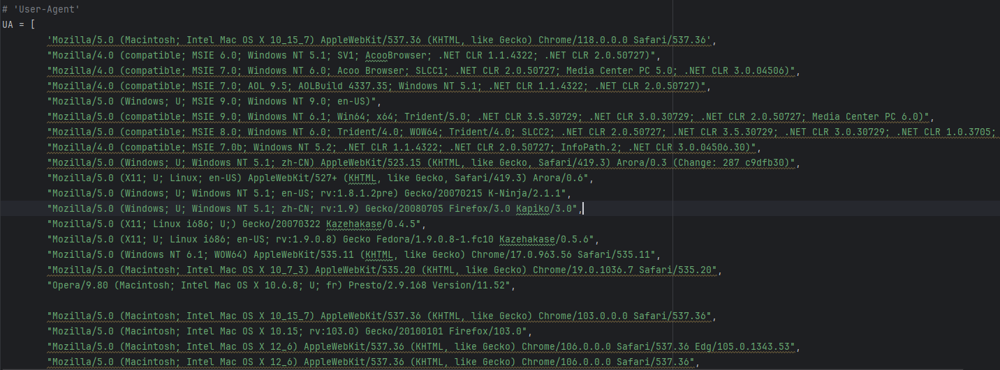


#### 2.2随机延时重试

网页获取失败时，可能是由于网络波动，也有可能是被反爬虫机制检测到了，于是设置随机延时后进行重试。

> ./functions.py

```py
    except Exception as e:
        if retries > 0:
            print(f"获取页面时出错: {e}, 重试中... ({retries})")
            time.sleep(random.uniform(1, 3))  # 添加随机延时
            return get_page(url, retries - 1)
        else:
            print(f"获取页面失败: {e}")
            return "error"
```

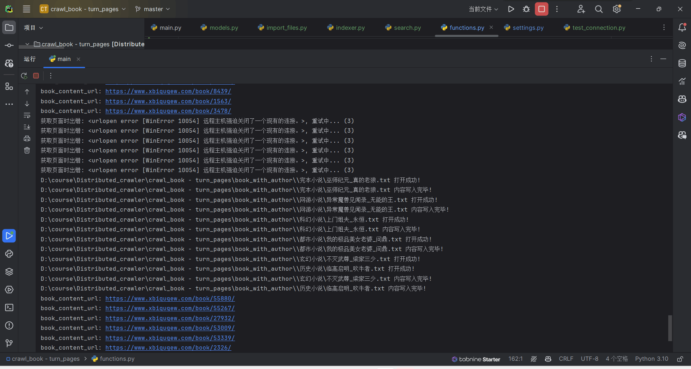


### 3.爬取效率优化

采用多线程分布式爬取，以提高效率，并且配合随机UA，模拟多台不同主机的并发访问。

```py
class MyThread(threading.Thread):
    def __init__(self, url, new_dir, visited_urls):
        threading.Thread.__init__(self)
        self.url = url
        self.new_dir = new_dir
        self.visited_urls = visited_urls

    def run(self):
        # 调用crawl_list_page函数处理类别页面
        crawl_list_page(self.url, self.new_dir, self.visited_urls)
```


### 4.爬取过程控制台输出截图

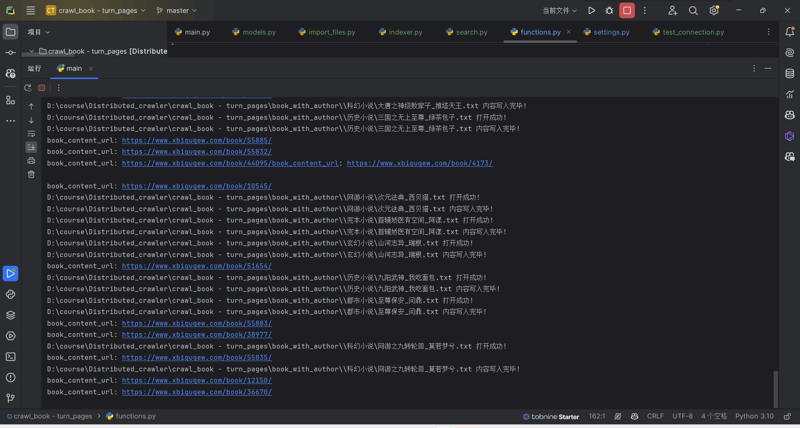


## 二、数据处理并导入数据库

### 1. 数据处理流程

在本次实验中，我从多个包含小说数据的文本文件中提取信息，并将其存储到 MySQL 数据库中。数据处理主要分为以下几个步骤：

1. **检测文件编码**： 使用 `chardet` 库检测每个文本文件的编码，以确保文件能够被正确读取。
2. **提取文件名中的小说信息**： 从文本文件名中提取小说的名称和作者名，并将这部分信息与小说章节数据一起保存到数据库中。
3. **读取文件内容**： 逐行读取文本文件内容，并解析其中的章节号、章节名以及章节的 URL。
4. **保存到数据库**： 使用 `peewee` 库将提取到的小说信息和章节数据存储到 MySQL 数据库中。

### 2. 数据库模型设计

在 `models.py` 文件中，我们定义了一个 `NovelChapter` 模型来表示数据库中的一张表。表结构如下：

- `novel_type`：小说类型
- `novel_name`：小说名称
- `novel_author`：小说作者
- `novel_chapter_num`：章节号
- `novel_chapter_name`：章节名
- `novel_chapter_url`：章节的 URL


### 3. 数据处理与导入实现

在 `import_files.py` 文件中实现了数据处理和导入数据库的逻辑：

**import_files.py**：

```py
# 检测文件编码
def detect_encoding(file_path):

# 导入文件数据
def import_files(directory):

if __name__ == "__main__":
    import_files('D:\\course\\Distributed_crawler\\crawl_book - turn_pages\\book_with_author')  # 使用实际的小说文件目录
```


### 4.数据处理以及导入过程控制台截图

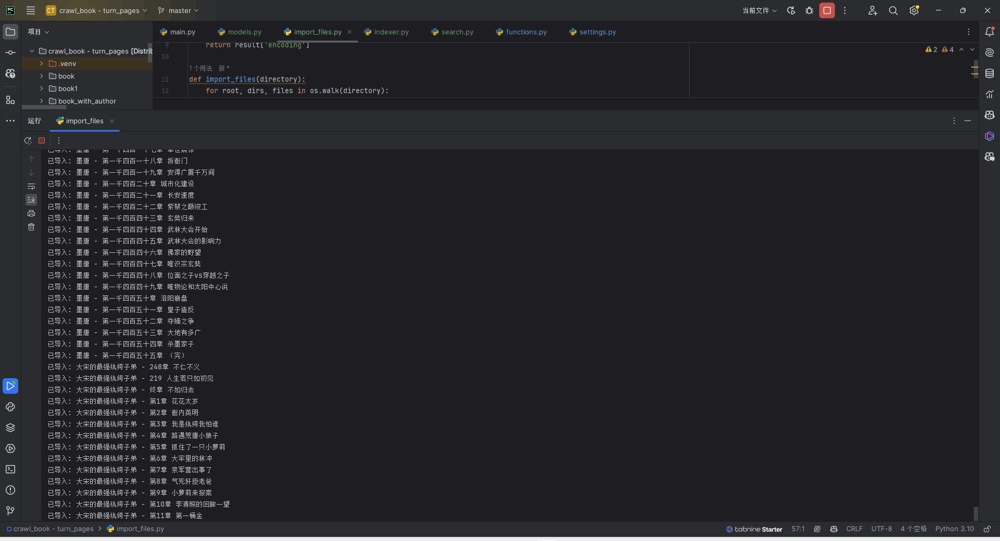


### 5.数据库数据展示

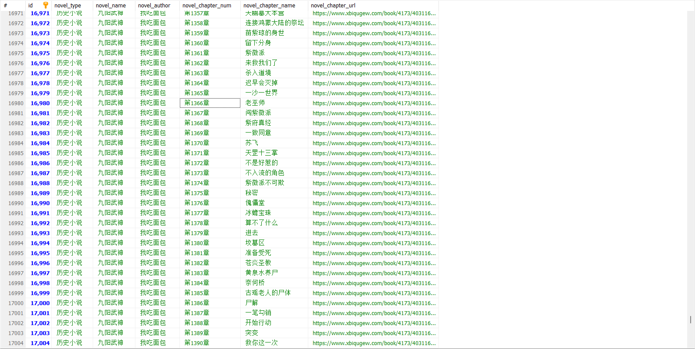


## 三、索引构建设计

> 在自然语言处理和全文检索的过程中，中文分词是一个重要的步骤。中文文本不像英文有明显的单词分隔符（如空格），因此需要分词工具将连续的汉字序列切分成有意义的词语。分词的准确性直接影响到后续的文本分析和检索效果。
>
> 以下是使用自定义词典的几个主要原因：
>
> #### 1. 提高分词准确性
>
> 通用分词器如 `jieba` 自带的词典覆盖了常见的中文词汇和短语，但在特定领域或特定应用场景下，通用词典可能不足以处理所有专业术语或特定命名实体。例如，在小说网站爬虫项目中，小说的作者名字、特定的书名、人物名等往往不是通用词典所能覆盖的。
>
> 通过加载自定义词典，可以确保这些特定词语在分词过程中被正确识别和处理，提高分词的准确性。例如，作者的名字作为小说数据的重要组成部分，如果不能被正确识别，将导致索引和检索的效果大打折扣。
>
> #### 2. 处理命名实体
>
> 命名实体（如人名、地名、机构名等）在文本处理中占有重要地位。很多命名实体并不在通用词典中，但在特定应用中却非常关键。通过自定义词典，可以添加这些命名实体，确保分词器能够正确识别和处理它们。例如，在小说文本中，主角、配角的名字，以及特定地点、组织的名称，如果没有被正确识别，可能会影响到小说内容的理解和检索效果。
>
> #### 3. 提高检索效果
>
> 准确的分词能够极大地提高全文检索的效果。检索系统依赖于倒排索引，倒排索引的构建过程需要将文档切分为词条，并为每个词条建立索引。如果分词不准确，将导致索引的不准确，进而影响到检索的相关性和召回率。通过自定义词典，可以确保特定领域的重要词汇被正确处理，从而提高检索系统的整体效果。
>
> #### 4. 灵活适应不同应用场景
>
> 不同的应用场景有不同的专业术语和特定词汇。通过自定义词典，分词器可以灵活适应不同的应用需求。例如，在本次实验中，针对小说数据中的特定词汇（如作者名），我们生成了自定义词典，使得分词器能够正确识别和处理这些词汇，确保索引和检索的准确性。
>
> 
>
> 
>
> **自定义词典文件中的每一行通常包含以下信息：**
>
> ```
> 词汇 词频 词性
> ```
>
> #### 1. 词汇
>
> 这是你希望分词器能够识别并正确处理的特定词语。例如，作者名字、特定专业术语、组织名称等。在本次实验中，词汇主要是小说作者的名字。
>
> #### 2. 词频
>
> 词频（frequency）是一个整数值，表示该词汇在文本中的出现频率。词频值越高，该词汇被识别为一个独立词语的优先级越高。通常，你可以给所有自定义词汇赋予一个较高的词频值（如1000），以确保这些词汇在分词过程中被正确识别。
>
> #### 3. 词性
>
> 词性（part-of-speech tagging）是一个简写标签，表示该词汇在句子中的语法角色。常见的词性标签包括：
>
> - `n`：名词
> - `nr`：人名
> - `ns`：地名
> - `nt`：机构团体
> - `nz`：其他专名
> - `v`：动词
> - `a`：形容词
> - `d`：副词

##### 1.1 索引构建流程

索引构建的主要流程如下：

1. **生成自定义词典**：从 `.txt` 文件的文件名中提取作者名字，生成自定义词典文件。
2. **加载自定义词典**：通过 jieba 加载自定义词典。
3. **定义索引 Schema**：指定需要索引的字段，包括小说类型、名称、章节号、章节名和章节 URL。
4. **创建或打开索引目录**：如果索引目录不存在，则创建新目录；否则，打开已有索引目录。
5. **从数据库中读取数据**：读取 NovelChapter 表中的所有章节数据。
6. **构建索引**：使用 Whoosh 的 writer 对象将数据逐条写入索引。
7. **提交索引**：将写入的索引数据提交保存。

##### 1.2 索引构建模块代码

以下是更新后的索引构建模块代码：

```py
# 使用 jieba 分词器进行中文分词
analyzer = ChineseAnalyzer()

# 生成自定义词典文件
def generate_custom_dict(directory):

# 加载自定义词典
def load_custom_dict():
    jieba.load_userdict('custom_dict.txt')

# 定义索引的 Schema，包含小说类型、名称、章节号、章节名、作者和URL字段
schema = Schema(
    novel_type=TEXT(stored=True, analyzer=analyzer),
    novel_name=TEXT(stored=True, analyzer=analyzer),
    novel_author=TEXT(stored=True, analyzer=analyzer),
    novel_chapter_num=TEXT(stored=True, analyzer=analyzer),
    novel_chapter_name=TEXT(stored=True, analyzer=analyzer),
    novel_chapter_url=ID(stored=True, unique=True)
)

# 创建索引目录
index_dir = "indexdir"

# 构建索引的函数
def build_index():

```

##### 1.3 代码详解

1. **生成自定义词典 (`generate_custom_dict` 函数)**： 从 `.txt` 文件的文件名中提取作者名字，并生成自定义词典文件 `custom_dict.txt`。词典文件格式为每行一个词，词后面是词频和词性标签。
2. **加载自定义词典 (`load_custom_dict` 函数)**： 使用 `jieba.load_userdict` 加载自定义词典文件。这样，在分词时可以识别出自定义词典中的词语。
3. **定义索引 Schema**： 使用 Whoosh 的 `Schema` 定义需要索引的字段，包括小说类型、名称、章节号、章节名和章节 URL。
4. **创建或打开索引目录**： 检查索引目录是否存在。如果不存在则创建新的索引目录；如果存在则打开已有索引目录。
5. **构建索引**： 从数据库中读取 NovelChapter 表中的所有章节数据，使用 Whoosh 的 writer 对象将数据逐条写入索引。在写入过程中，记录处理进度并输出日志。
6. **提交索引**： 将写入的索引数据提交保存，确保所有数据都已正确写入索引库。

##### 1.4 索引构建截图

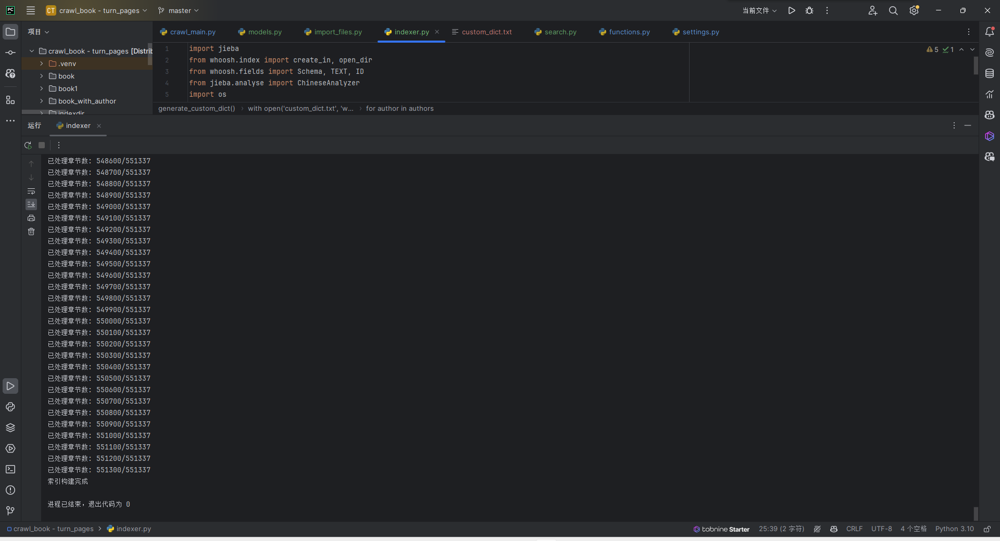

##### 1.5自定义词典展示

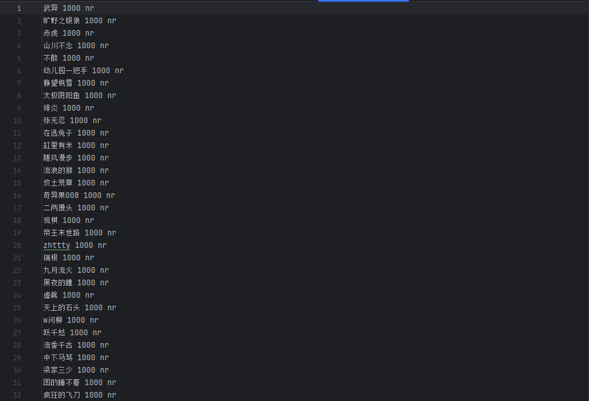


## 四、搜索与推荐模块

在该模块中，首先加载自定义词典，以增强对小说作者姓名的分词效果。接下来，打开已构建的索引，并创建一个多字段查询解析器，用于解析用户输入的搜索关键词。然后，使用BM25F算法进行搜索，以确保结果的相关性。搜索结果将高亮显示匹配的部分。

为了推荐同类型和同作者的小说，首先统计搜索结果中前五个不同的小说类型和作者名。如果类型或作者数量不足五个，则使用第一个类型或作者补足推荐数量。推荐结果中确保小说名称不重复，以提供更丰富的阅读选择。

### 1.步骤与代码实现

#### 1.1加载自定义词典

在搜索前加载自定义词典，以增强对作者名的分词效果。

```py
jieba.load_userdict('custom_dict.txt')
```

#### 1.2打开索引目录

打开预先构建的Whoosh索引。

```
ix = open_dir("indexdir")
```

#### 1.3创建查询解析器并解析查询

创建一个多字段查询解析器，并解析用户输入的搜索关键词。

```python
qp = MultifieldParser(["novel_type", "novel_name", "novel_author", "novel_chapter_num", "novel_chapter_name"], schema=ix.schema)
q = qp.parse(query_str)
```

#### 1.4进行搜索并显示结果

使用BM25F模型进行搜索，显示最匹配的前10条结果，并高亮显示匹配部分.

```python
with ix.searcher(weighting=scoring.BM25F()) as s:
    results = s.search(q, limit=10)
    for result in results:
        # 高亮显示
        novel_type = highlight_text(result.highlights("novel_type") or result["novel_type"])
        # 打印结果
        print(f"小说类型: {novel_type}")
```

#### 1.5推荐同类型和同作者的小说

统计前五个不同的小说类型和作者名，分别进行推荐。

```python
# 统计小说类型和作者名
novel_types = []
novel_authors = []
seen_novels = set()
for result in results:
    if result["novel_type"] not in novel_types:
        novel_types.append(result["novel_type"])
    if result["novel_author"] not in novel_authors:
        novel_authors.append(result["novel_author"])

# 推荐同类型小说
recommended_types = recommend_by_field(s, "novel_type", novel_types, 5, seen_novels, ix)

# 推荐同作者小说
recommended_authors = recommend_by_field(s, "novel_author", novel_authors, 5, seen_novels, ix)
```

#### 1.6函数定义

定义辅助函数，用于添加推荐的小说，并确保推荐的小说名称不重复。

```py
def add_recommendations(searcher, field, value, recommendations, unique_recommendations, seen_novels, ix, needed):
    qp = MultifieldParser([field], schema=ix.schema)
    q = qp.parse(value)
    results = searcher.search(q, limit=needed * 2)
    for result in results:
        novel_info = {
            "小说类型": result["novel_type"],
            "小说名称": result["novel_name"],
            "作者": result["novel_author"],
            "章节号": result["novel_chapter_num"],
            "章节名": result["novel_chapter_name"],
            "章节URL": result["novel_chapter_url"]
        }
        if novel_info["小说名称"] not in unique_recommendations and novel_info["小说名称"] not in seen_novels:
            unique_recommendations.add(novel_info["小说名称"])
            recommendations.append(novel_info)
        if len(recommendations) >= needed:
            break
```


### 2.搜索结果展示

#### 2.1控制台输出

```shell
C:\Users\21811\AppData\Local\Programs\Python\Python310\python.exe D:\course\SearchEngine\Book_SearchEngine\search.py 
请输入搜索关键词: 飞鸟
Building prefix dict from the default dictionary ...
Loading model from cache C:\Users\21811\AppData\Local\Temp\jieba.cache
Loading model cost 0.513 seconds.
Prefix dict has been built successfully.
最匹配的搜索结果[共12条相关记录，显示匹配度最高的前10条]:
小说类型: 完本小说
小说名称: 极品狂医
作者: 二两馒头
章节号: 第6638章
章节名: 飞鸟
章节URL: https://www.xbiqugew.com/book/45533/40586638.html
==================================================
小说类型: 玄幻小说
小说名称: 雷武
作者: 中下马笃
章节号: 第四百九十一章
章节名: 飞鸟
章节URL: https://www.xbiqugew.com/book/221/27194015.html
==================================================
小说类型: 历史小说
小说名称: 花豹突击队
作者: 竹香书屋
章节号: 第四千一百八十三章
章节名: 山间飞鸟
章节URL: https://www.xbiqugew.com/book/560/28476955.html
==================================================
小说类型: 完本小说
小说名称: 极品狂医
作者: 二两馒头
章节号: 第6629章
章节名: 飞鸟袭击
章节URL: https://www.xbiqugew.com/book/45533/40585550.html
==================================================
小说类型: 玄幻小说
小说名称: 惊天剑帝
作者: 帝剑一
章节号: 第906章
章节名: 飞鸟传信
章节URL: https://www.xbiqugew.com/book/30752/21629965.html
==================================================
小说类型: 玄幻小说
小说名称: 惊天剑帝
作者: 帝剑一
章节号: 第4015章
章节名: 飞鸟难遁
章节URL: https://www.xbiqugew.com/book/30752/35398621.html
==================================================
小说类型: 历史小说
小说名称: 天唐锦绣
作者: 公子許
章节号: 第一千八百一十一章
章节名: 挥师飞鸟京
章节URL: https://www.xbiqugew.com/book/8614/28459448.html
==================================================
小说类型: 历史小说
小说名称: 最强终极兵王
作者: 夜星下
章节号: 第1212章
章节名: 1209：漫天飞鸟
章节URL: https://www.xbiqugew.com/book/27334/24113621.html
==================================================
小说类型: 完本小说
小说名称: 贴身狂医
作者: 六月添狗
章节号: 第六百零六章
章节名: 飞鸟镇瘟疫
章节URL: https://www.xbiqugew.com/book/55894/40817612.html
==================================================
小说类型: 科幻小说
小说名称: 踏星
作者: 随散飘风
章节号: 第四千三百六十八章
章节名: 飞鸟为王
章节URL: https://www.xbiqugew.com/book/31028/40080582.html
==================================================
----------------------------------------------------------------------------------------------------------------------------------------------------
------------------------------------------------------------------*****推荐阅读*****------------------------------------------------------------------
小说类型: 完本小说
小说名称: 1627崛起南海
作者: 零点浪漫
章节号: 1.第1章
章节名: 那一扇上天打开的门
章节URL: https://www.xbiqugew.com/book/6550/4280211.html
==================================================
小说类型: 玄幻小说
小说名称: 万古天帝
作者: 第一神
章节号: 第四千八百三十二章
章节名: 背后势力逆元黑根！
章节URL: https://www.xbiqugew.com/book/1795/40818519.html
==================================================
小说类型: 历史小说
小说名称: NBA：开局一张三分体验卡
作者: 一江秋月
章节号: 第1章
章节名: 开局一张三分体验卡
章节URL: https://www.xbiqugew.com/book/53086/39136926.html
==================================================
小说类型: 科幻小说
小说名称: 三国神话世界
作者: 永牧
章节号: 第二千三百一十五章
章节名: 博弈（上）
章节URL: https://www.xbiqugew.com/book/54625/40796060.html
==================================================

进程已结束，退出代码为 0

```

#### 2.2截图

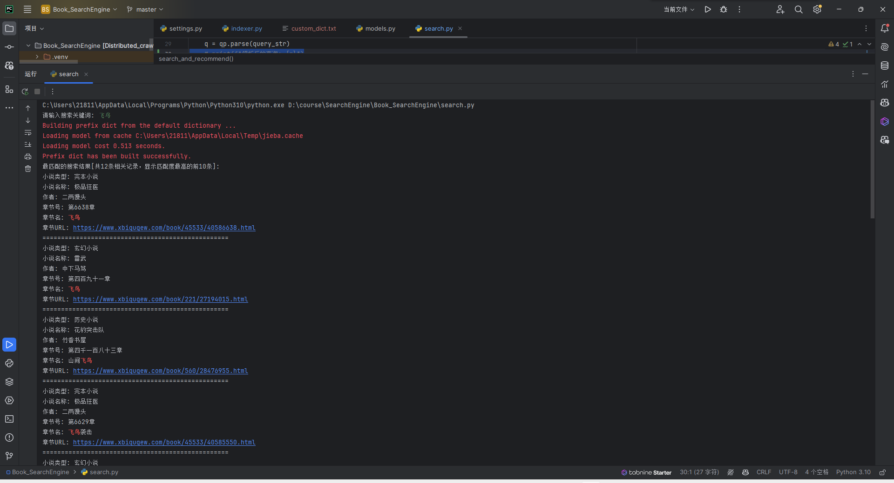

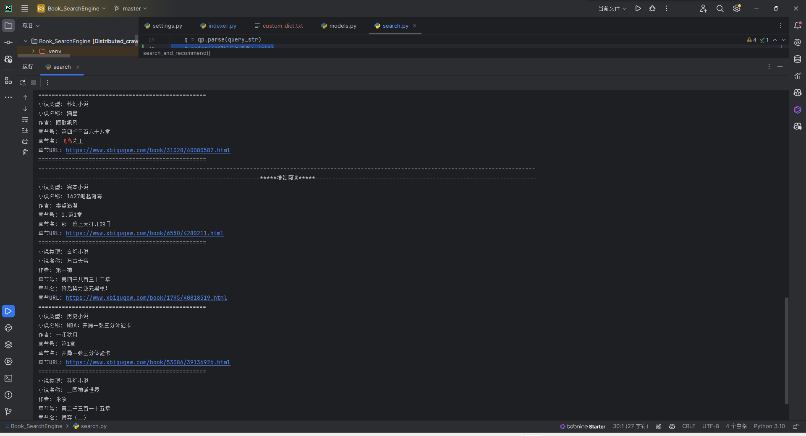


## 五、前端及网页设计

### 5.1 前端概述

本实验的前端部分主要使用HTML和CSS来构建用户界面，并通过JavaScript实现动态数据加载和用户交互。我使用Flask框架来搭建Web应用，处理用户请求并返回相应的搜索结果和推荐内容。

### 5.2 目录结构

```
plaintext复制代码Book_SearchEngine/
├── app.py                 # Flask 应用
├── templates/             # 模板目录
    └── index.html         # 前端模板
```

### 5.3 前端页面设计

#### 5.3.1 HTML 模板

在`templates`目录下创建了`index.html`文件，用于构建用户界面。

#### 5.3.2 CSS 样式

在HTML模板中使用内嵌CSS样式，为页面元素定义样式，包括搜索框、搜索按钮、搜索结果和推荐阅读区域等。

#### 5.3.3 JavaScript 实现动态加载

使用JavaScript实现无限滚动加载更多搜索结果的功能。

#### 5.3.4 触底反馈

用户滚动到底部加载更多结果时，将显示“加载中...”提示，数据加载完成后自动隐藏。

1. **加载指示器**：在HTML模板中添加一个`<div>`元素，用于显示加载中的状态。

   ```
   <div id="loading">加载中...</div>
   ```

2. **JavaScript中控制加载指示器的显示和隐藏**：

   - 当触底时，显示加载指示器。
   - 数据加载完成后，隐藏加载指示器。


### 5.4 后端处理逻辑

后端使用Flask框架来处理用户请求，搜索和推荐逻辑如下：

#### 5.4.1 配置日志系统

在`app.py`中配置日志系统以记录用户的搜索查询。

```python
import logging

logging.basicConfig(level=logging.INFO, format='%(asctime)s - %(message)s', handlers=[logging.FileHandler("search_logs.log"), logging.StreamHandler()])
```

#### 5.4.2 搜索与推荐逻辑

使用Whoosh进行全文搜索，并根据关键词返回搜索结果和推荐内容。


#### 5.4.3 处理无限滚动加载更多结果

在`app.py`中添加处理无限滚动加载更多结果的路由。


#### 5.4.4 统计结果数量并在前端显示

```py
        if len(results) == 0:
            return {"results": [], "recommendations": [], "total": 0}
```


## 六、前端界面展示

**主页：**


**详情页：**


**触底动态加载动画：**


**日志记录：**

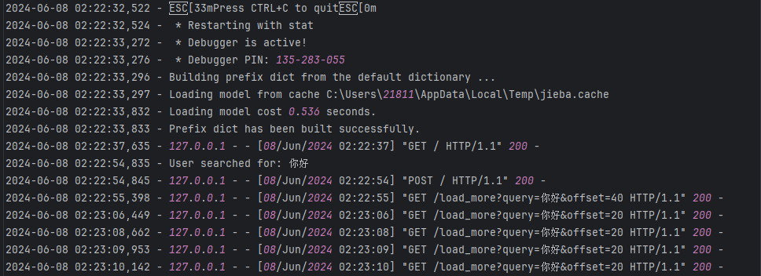
